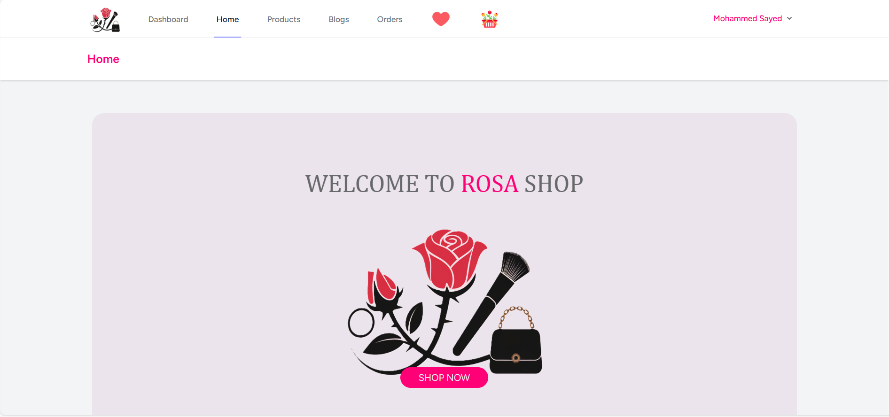

# 🌹 Rosa Shop – E-commerce Web Application

Rosa Shop is a modern and complete e-commerce web application built with **PHP Laravel**, **MySQL**, and **Livewire**. It offers a seamless shopping experience for users and a powerful admin dashboard for managing products, orders, users, and more.

---

## 🚀 Live Demo

🔗 [View Live Website](https://rosa.mo-sayed.site)

---

## 🛠️ Tech Stack

- **PHP Laravel** – Backend Framework  
- **MySQL** – Database  
- **Livewire** – For reactive frontend (no page reloads)  
- **SMTP Mail** – For sending emails  
- **Paymob** – Payment Gateway Integration  
- **Google OAuth** – Social login  
- **Hostinger** – Deployment & Hosting  

---

## ✨ Features

### ✅ User Features

- Register & login (with Google or email)
- Add products to cart and favorites (Livewire)
- Contact form with email (SMTP)
- Place orders with **cash** or **online payment** (Paymob)
- Receive **email notifications** about offers & news
- View **top/best-selling** products

### 🔧 Admin Dashboard

- Manage **products**, **categories**, **orders**
- Manage **users**, **roles**, and **permissions**
- Control **shipping cost** and apply **discounts**
- Send **email newsletters** using **queue jobs** (SMTP)

---

## 📦 Installation & Setup

1. **Clone the repository**
   ```bash
   git clone https://github.com/your-repo.git
   cd rosa-shop
   ```

2. **Install dependencies**
   ```bash
   composer install
   npm install
   npm run dev
   ```

3. **Set up `.env`**
   ```bash
   cp .env.example .env
   php artisan key:generate
   ```

4. **Update your environment variables** in `.env`:
   - Database credentials
   - Mail configuration (SMTP)
   - Paymob API keys
   - Google OAuth credentials

5. **Run migrations**
   ```bash
   php artisan migrate
   ```

6. **Start the development server**
   ```bash
   php artisan serve
   ```

---

## 📸 Screenshots

<p align="center">
    
</p>

---

## 🌐 Deployment

- Deployed to **Hostinger** with a custom **subdomain**
- Includes environment configuration for production

---

## 📬 Contact

If you have any questions or suggestions, feel free to reach out:

📧 your-email@example.com  
🔗 [LinkedIn Profile](https://www.linkedin.com/in/mohamed-sayed-back-end0)

---
